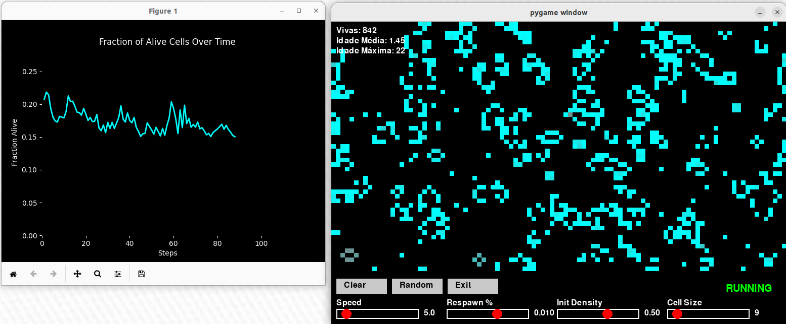

## Conway's Game of Life (Fast)
Esta implementação do jogo da vida buscou juntar algo diferente que era de interesse de todos do grupo, a não determinicidade, para assim, modelar visualizações interessantes com o modelo probabilístico.
As visualizações implementadas são variadas, que vão desde criptografia (simples) até algo que se assemelha ao modelo predador-presa.   



### Overview
O Jogo da Vida de [Conway](https://en.wikipedia.org/wiki/Conway%27s_Game_of_Life) é um autômata celular clássico, onde cada célula pode estar viva ou morta. O estado da célula muda com o tempo baseado em algumas regras que depende da quantidade de vizinhos. Em nossa implementação base do jogo, a ocorrência da morte ou nascimento de uma célula não baseia-se somente nas regras, mas também em uma determinada probabilidade.

#### Running the Model
Para observar as visualizações, basta ecessar os arquivos que possuem 'visualizacao' no começo do nome, cada pasta possui sua própria visualização e modelo. 

### Comentários do repositório original

#### Key features:
- **No grid or agents:** This implementation uses the `PropertyLayer` to manage the state of cells, eliminating the need for traditional grids or agents.
- **Fast:** By using 2D convolution to count neighbors, the model efficiently applies the rules of the Game of Life across the entire grid.
- **Toroidal:** The grid wraps around at the edges, creating a seamless, continuous surface.

#### Performance
The model is benchmarked in https://github.com/projectmesa/mesa/pull/1898#issuecomment-1849000346 to be about 100x faster over a traditional implementation.


- Benchmark code: [benchmark_gol.zip](https://github.com/projectmesa/mesa/files/13628343/benchmark_gol.zip)

### Getting Started
#### Prerequisites
- Python 3.10 or higher
- Mesa 2.3 or higher (3.0.0b0 or higher for the visualisation)
- NumPy and SciPy
```
### Understanding the Code
- **Model initialization:** The grid is represented by a `PropertyLayer` where each cell is randomly initialized as alive or dead based on a given probability.
- **`PropertyLayer`:** In the `cell_layer` (which is a `PropertyLayer`), each cell has either a value of 1 (alive) or 0 (dead).
- **Step function:** Each simulation step calculates the number of alive neighbors for each cell and applies the Game of Life rules.
- **Data collection:** The model tracks and reports the number of alive cells and the fraction of the grid that is alive.

### Customization
You can easily modify the model parameters such as grid size and initial alive fraction to explore different scenarios. You can also add more metrics or visualisations.

### Summary
This example provides a fast approach to modeling cellular automata using Mesa's `PropertyLayer`.

### Future work
Add visualisation of the `PropertyLayer` in SolaraViz. See:
- https://github.com/projectmesa/mesa/issues/2138
